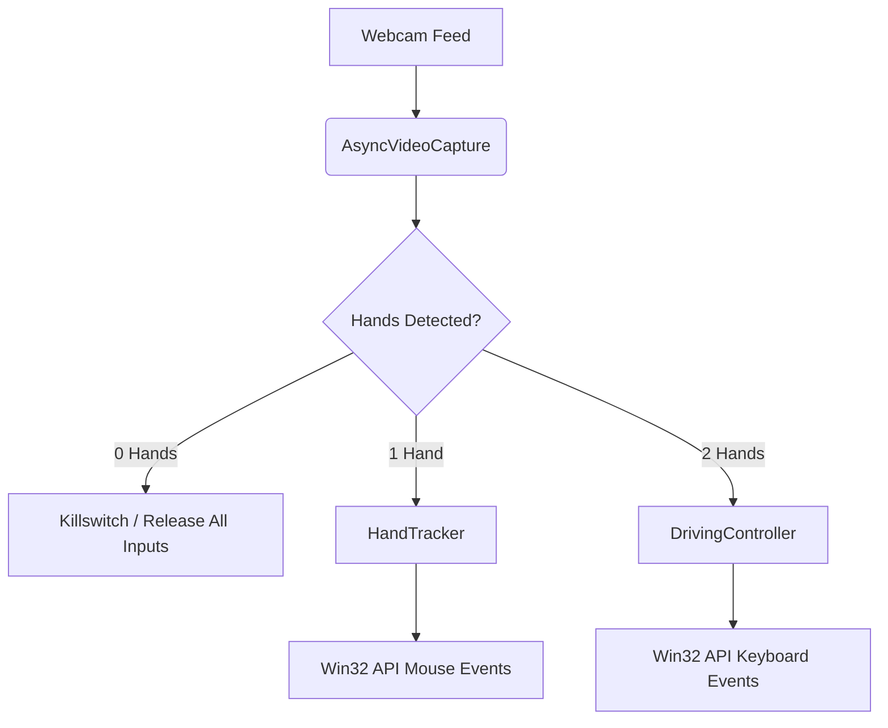

# Hand Gesture OS Controller

This repository contains a dual-mode Python application that uses webcam input to translate real-time hand tracking into operating system commands. It relies on computer vision to seamlessly switch between a virtual mouse and a driving simulator controller based on the number of hands detected on screen.

## Core Features

*   **Dynamic Mode Switching:** The system automatically engages driving mode when two hands are visible and switches to mouse mode when only one hand is detected.
*   **1-Hand Mouse Tracking:** Maps the index finger's MCP joint (Landmark 5) to the screen cursor using Exponential Moving Average (EMA) smoothing for stability.
*   **Pinch-to-Click:** Simulates left mouse clicks by calculating the raw pixel distance between the index fingertip and thumb tip.
*   **2-Hand Driving Simulation:** Calculates the angle between both hands to steer, and the distance between them to control throttle and braking.
*   **PWM Keyboard Output:** Simulates proportional analog input by rapidly pulsing the W, A, S, and D keys via a Pulse Width Modulation (PWM) accumulator.
*   **Low-Latency Capture:** Utilizes a background threading model for webcam frame extraction to prevent input lag.

## Architecture Visualization

## Tech Stack & Dependencies

| Dependency | Version | Purpose |
| :--- | :--- | :--- |
| `opencv-python` | 5.0.0.93 | Webcam interfacing, image processing, and visual annotations. |
| `mediapipe` | 0.10.9 | Core machine learning model for extracting 3D hand landmarks. |
| `numpy` | 2.4.6 | Linear algebra calculations for angles, distances, and interpolation. |

*(For deeper information on the tracking logic, refer to the [MediaPipe Hand Landmarker documentation](https://developers.google.com/mediapipe/solutions/vision/hand_landmarker).)*

## Installation & Usage

1. Clone this repository to your local machine.
2. Install the exact required dependencies listed in the `requirements.txt` file to ensure compatibility.
3. Execute `main.py` to start the asynchronous webcam feed and gesture tracking.
4. Press `q` or `Q` at any time to safely exit the application, close windows, and release all simulated inputs.

---

## System Limitations & Technical Debt

While this prototype accomplishes its primary goals, it contains severe architectural mistakes and bad practices that will cause problems if deployed as-is. You need to fix these issues before scaling:

*   **Strict Operating System Lock-in:** The codebase is permanently hardcoded to Windows environments due to its absolute reliance on `ctypes.windll.user32` for hardware input simulation. Attempting to run this on Linux or macOS will result in immediate fatal crashes.
*   **Redundant Memory Allocation:** The `main.py` entry point correctly creates a global MediaPipe `Hands` instance to route logic, but the `DrivingController` incorrectly allocates a completely separate, unused instance of the ML model in its constructor. This wastes processing overhead and memory.
*   **Brittle Hardcoded Variables:** The tracking logic relies heavily on unexposed magic numbers, such as a strict 75-pixel margin for the active screen area. This guarantees the script will break or behave erratically for users with different webcam aspect ratios or crop factors.
*   **Flawed Input Emulation:** Using a custom PWM loop to spam keyboard inputs (W, A, S, D) for driving is a fundamentally bad approach for gaming. It will introduce severe input stuttering and latency in modern racing titles. True proportional control requires emulating an XInput protocol (acting as a virtual Xbox controller).