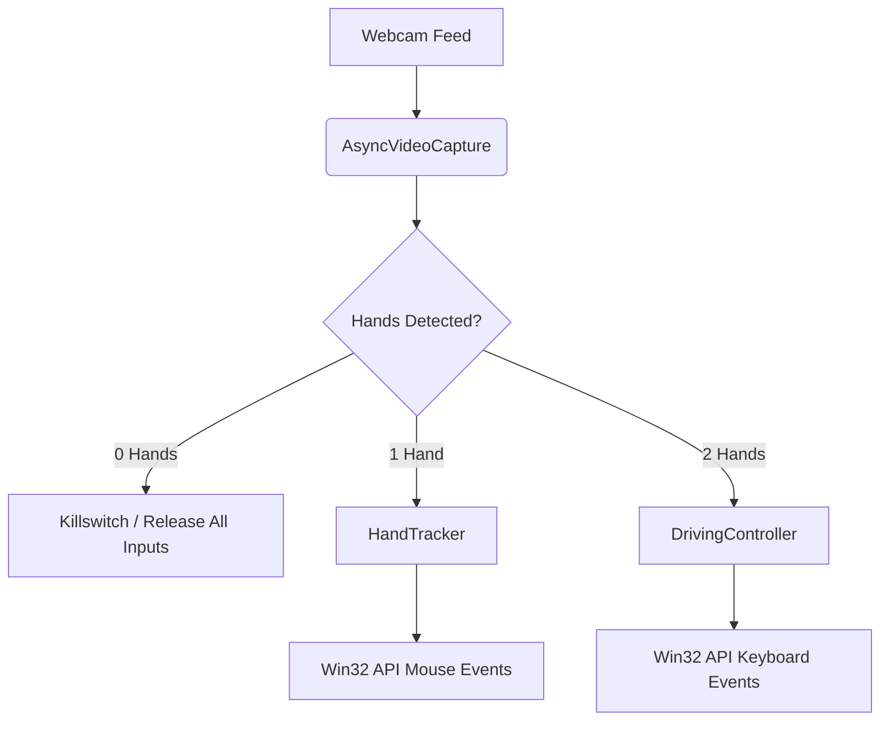

# Hand Gesture OS Controller

This repository contains a dual-mode Python application that uses webcam input to translate real-time hand tracking into windows operating system commands. It relies on computer vision to seamlessly switch between a virtual mouse and a driving simulator controller based on the number of hands detected on screen.

## Core Features

*   **Dynamic Mode Switching:** The system automatically engages driving mode when two hands are visible and switches to mouse mode when only one hand is detected.
*   **1-Hand Mouse Tracking:** Maps the index finger's MCP joint (Landmark 5) to the screen cursor using Exponential Moving Average (EMA) smoothing for stability.
*   **Pinch-to-Click:** Simulates left mouse clicks by calculating the raw pixel distance between the index fingertip and thumb tip.
*   **2-Hand Driving Simulation:** Calculates the angle between both hands to steer, and the distance between them to control throttle and braking.
*   **PWM Keyboard Output:** Simulates proportional analog input by rapidly pulsing the W, A, S, and D keys via a Pulse Width Modulation (PWM) accumulator.
*   **Low-Latency Capture:** Utilizes a background threading model for webcam frame extraction to prevent input lag.

## Architecture Visualization


```mermaid
graph TD
    A[Webcam Feed] --> B(AsyncVideoCapture)
    B --> C{Hands Detected?}
    C -->|0 Hands| D[Killswitch / Release All Inputs]
    C -->|1 Hand| E[HandTracker]
    C -->|2 Hands| F[DrivingController]
    E --> G[Win32 API Mouse Events]
    F --> H[Win32 API Keyboard Events]
```

## Tech Stack & Dependencies

| Dependency | Version | Purpose |
| :--- | :--- | :--- |
| `opencv-python` | 5.0.0.93 | Webcam interfacing, image processing, and visual annotations. |
| `mediapipe` | 0.10.9 | Core machine learning model for extracting 3D hand landmarks. |
| `numpy` | 2.4.6 | Linear algebra calculations for angles, distances, and interpolation. |
| `streamlit` | Latest | Web-based dashboard UI to easily launch and manage the controller. |

*(For deeper information on the tracking logic, refer to the [MediaPipe Hand Landmarker documentation](https://developers.google.com/mediapipe/solutions/vision/hand_landmarker).)*

## Installation & Usage

1. Clone this repository to your local machine.
2. Install the exact required dependencies listed in the `requirements.txt` file to ensure compatibility:
   ```bash
   pip install -r requirements.txt
   ```
3. You can either run the background controller directly:
   ```bash
   python main.py
   ```
   Or use the Streamlit Dashboard for an easy-to-use interface:
   ```bash
   streamlit run app.py
   ```
4. Press `q` or `Q` (or use the Stop button in the Streamlit UI) at any time to safely exit the application, close windows, and release all simulated inputs.

---